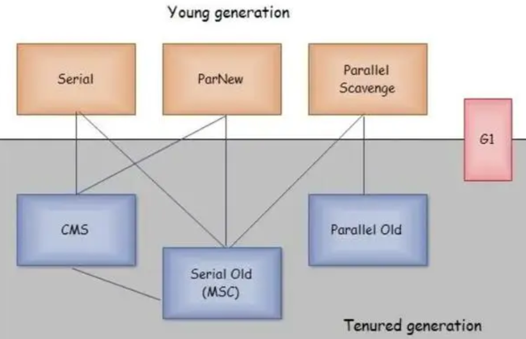
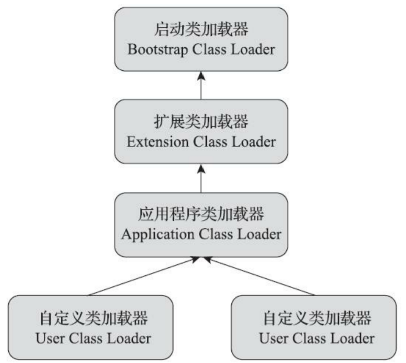
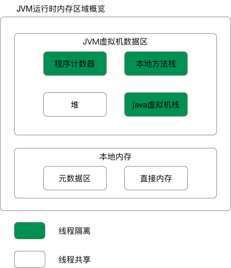
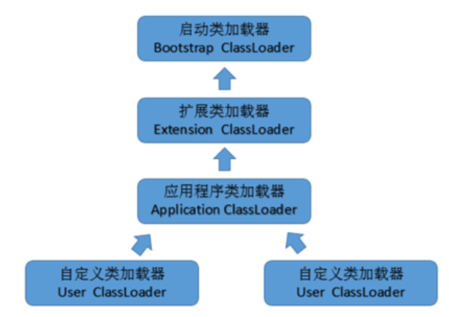
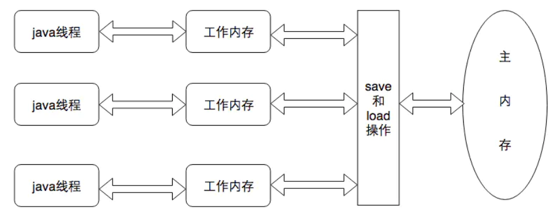

## 1.如何判断对象已死（垃圾判断）

1、引用计数法（早期用，现在基本不用）

原理：给对象设置一个引用计数器，每增加一个变量对它的引用，引用计数器就会加1，每减少一个变量的引用，引用计数器就会减1，只要当对象的引用计数器变成0，该对象就会被回收。

缺点：1、这种方法每次在增加变量引用和减少引用时都要进行加法或减法操作，频繁操作对象增加系统消耗。2、是这种方法无法处理循环引用的情况，导致内存泄漏。对象A和B，A引用了B，B中也引用A，那它们的引用计数器永远都不为0，无法回收。

2、根搜索法（可达性分析）

原理：通过一系列的GC Roots的对象作为起始点，从这些根节点开始向下搜索，搜索所走过的路径称为引用链（Reference Chain），当一个对象到GC Roots没有任何引用链相连时，则证明此对象是不可用的。

可作为根节点的对象：

虚拟机栈（栈帧中的本地变量表）中引用的对象。

方法区中的类静态属性引用的对象或者常量引用的对象。

本地方法栈中JNI（就是native方法）引用的对象。

第三版增加（Java虚拟机内部的引用，如基本数据类型对应的Class对象，一些常驻的异常对象（比如NullPointExcepiton、OutOfMemoryError）等，还有系统类加载器。所有被同步锁（synchronized关键字）持有的对象。反映Java虚拟机内部情况的JMXBean、JVMTI中注册的回调、本地代码缓存等）

## 2.讲讲垃圾回收（GC）算法

1、标记清除法（基础算法）

原理：将垃圾回收分为两个阶段：标记阶段与清除阶段。首先标记处所有需要回收的对象，标记完成后，统一回收掉所有被标记的对象，也可以标记存活的对象，统一回收所有未被标记的对象。

缺点：1、是执行效率不稳定。如果Java堆中包含大量对象，而且其中大部分是需要被回收的，这时必须进行大量标记和清除的动作，导致标记和清除两个过程的执行效率都随对象数量增长而降低。2、是内存空间的碎片化问题，标记、清除之后会产生大量不连续的内存碎片。空间碎片太多可能会导致当以后在程序运行过程中需要分配较大对象时无法找到足够的连续内存而不得不提前触发另一次垃圾收集动作。

2、标记复制法（新生代）

原理：将可用内存按容量划分为大小相等的两块，每次只使用其中的一块。当这一块的内存用完了，就将还存活着的对象复制到另外一块上面，然后再把已使用过的内存空间一次清理掉。新生代比较适合，IBM研究新生代中的对象有98%熬不过第一轮收集。

缺点：使内存空间对折，利用效率太低。

3、标记整理法（老年代）

原理：标记过程仍然与“标记-清除”算法一样，但后续步骤不是直接对可回收对象进行清理，而是让所有存活的对象都向内存空间一端移动，然后直接清理掉边界以外的内存。标记-清除算法与标记-整理算法的本质差异在于前者是一种非移动式的回收算法，而后者是移动式的。

缺点：对象存活率高（标记的对象多）时要进行大量复制操作，增加系统消耗，效率低，需要大量时间。

4、分代收集法

原理：当前主流虚拟机都采用，没有新的思想，只是将Java堆化为新生代、老年代。

比如新生代gc时会有大量对象死去，选择标记复制法，老年代对象存活几率高，就使用标记整理法或者标记清除法。

## 3.有哪些垃圾收集器？区别

更多：https://www.cnblogs.com/webor2006/p/11048407.html

JVM提供的收集器较多，特征不一，适用于不同的业务场景：

Serial收集器：串行运行，即单线程；作用于新生代；复制算法；响应速度优先；适用于单CPU环境下的client模式。其单线程设计也意味着精简的 GC 实现，无需维护复杂的数据结构，初始化也简单，所以一直是 Client 模式下 JVM 的默认选项

ParNew收集器：并行运行，即多线程，serial的多线程版本；作用于新生代；复制算法；响应速度优先；多CPU环境Server模式下与CMS配合使用。

Parallel Scavenge收集器：并行运行，即多线程；作用于新生代；复制算法；吞吐量优先；适用于后台运算而不需要太多交互的场景。

Serial Old收集器：串行运行，即单线程；作用于老年代；标记-整理算法；响应速度优先；单CPU环境下的Client模式。serial的老年代版本

Parallel Old收集器：并行运行，即多线程；作用于老年代；标记-整理算法；吞吐量优先；适用于后台运算而不需要太多交互的场景。

CMS收集器：并发运行；作用于老年代；标记-清除算法；响应速度优先；适用于互联网或B/S业务。高并发低停顿，追求最短gc回收停顿时间。

Concurrent Mark Sweep，说明是标记清除法，步骤：

1、初始标记：暂停所有线程，标记GC root直接关联的对象，速度很快，stop the word

2、并发标记：可同时开启GC和用户线程，在应用程序线程运行的时候标记GC root引用的所有其他对象

3、重新标记：修正并发标记时用户程序继续运行产生变动的标记，遗漏的对象，用时比1长一点，比2短，stop the word

4、并发清除：并发，用户线程可同时执行，同时清理删除标记的对象

G1收集器：并发运行；可作用于新生代或老年代；整体是标记-整理算法+局部复制算法；响应速度优先；面向服务端应用。作用范围整个Java堆，前面的都只作用一个，它的新生代老年代只是概念，实际上没有物理隔离，都是一部分地址连续region的集合，每个区域大小1-32M

1、初始标记：stop the word，标记直接可达的对象并将它们的字段压入扫描栈

3、并发标记：并发，根据扫描栈的信息引用递归整个堆的对象，标记所有可达的存活对象，允许被年轻代GC打断，耗时较长

4、最终标记：stop the word，跟踪未访问到的存活对象，处理引用

5、筛选回收：stop the word，更新regin统计的数据，对回收价值和成本排序，指定回收计划，清理对象

注意和CMS对比记忆

## 4.类加载过程（类的生命周期）

类加载过程一共分为5个阶段：加载、验证、准备、解析、初始化+使用+卸载（加验准解初），验证、准备、解析又称为连接

1、加载：

在加载阶段，虚拟机需要完成以下3件事情：

1、通过一个类的全限定名来获取定义此类的二进制字节流。

2、将这个字节流所代表的静态存储结构转化为方法区的运行时数据结构。

3、在内存中生成一个代表这个类的java.lang.Class对象，作为方法区这个类的各种数据的访问入口。

加载.class文件方式：从本地系统中直接加载、通过网络下载.class文件、从zip，jar等归档文件中加载.class文件、从专有数据库中提取.class文件、将Java源文件动态编译为.class文件 

2、验证：**目的是为了确保Class文件的字节流中包含的信息符合当前虚拟机的要求，并且不会危害虚拟机自身的安全**。Java相对C/C++来说是相对安全的语言，使用纯粹的Java代码无法做到访问数组边界以外的数据。但是字节码并不一定是Java源码编译来的。验证阶段大致上会完成下面4个阶段的检验动作：**文件格式验证，元数据验证，字节码验证，符号引用验证**。

3、准备：**为类中的变量分配内存并设置类变量初始值**（默认值），这些变量所使用的内存都将在方法区中进行分配。

4、解析：解析阶段是虚拟机将**常量池内的符号引用替换为直接引用（内存地址）**的过程。

符号引用与虚拟机实现的内存布局无关，引用的目标并不一定已经加载到内存中。

直接引用是和虚拟机实现的内存布局相关的，如果有了直接引用，那么引用的目标必定已经在内存中存在。

5、初始化：类初始化阶段是类加载过程的最后一步，到了初始化阶段，才真正**开始执行类中定义的Java程序代码**（或者说是字节码）。

## 5.什么是双亲委派模型

每⼀个类都有⼀个对应它的类加载器。系统中的 ClassLoder 在协同工作的时候会默认使用双亲委派模型 。即在类加载的时候，系统首先在缓存里判断当前类是否被加载过。已经被加载的类会直接返回，否则才会尝试加载。加载的时候，首先会把该请求委派该父类加载器的 loadClass() 处理，因此所有的请求最终都应该传送到顶层的启动类加载器 BootstrapClassLoader 中。当父类加载器无法处理时，再层层往下传递，才由自己来处理，调用findClass（）方法加载。除了启动类加载器，每个类加载器都有父类加载器，如果父类加载器为null时，就会使用启动类加载器 BootstrapClassLoader作为父类加载器

简单来说就是：先判断是否加载过，加载过就直接返回，然后先找父类加载器加载，找不到才找当前加载器的父加载器去做，目的是避免重复加载，保证类的全局唯一性，，通过这个机制，总是从最可信的Java核心API查找类型，防止不可信的类，如果编写一个与核心类库重名的类，能编译但不能加载运行，因为总是不断委托到顶层去加载，最后启动类加载器在核心类库里找到

如果不想用双亲委派模型，就自己定义一个类加载器，然后**重载loadClass()方法**即可

扩展：

启动类加载器：BootstrapClassLoader，加载的是jre和jre/lib目录下的核心库

扩展类加载器：ExtentionClassLoader，加载的是jre/lib/ext目录下的扩展包

应用类加载器：AppClassLoader （也叫做“系统类加载器”），加载我们自己的Java代码编译成的class文件所在

## 6.JVM运行时数据区（运行时内存区域）

1.8以前：方法区（也叫永久代）、堆、虚拟机栈、程序计数器、本地方法栈

1.8以后：堆、虚拟机栈、程序计数器、本地方法栈，方法区（改叫元空间）移到了直接内存里，叫元空间，直接内存不属于虚拟机

**程序计数器：**

线程私有，唯一一块不会OOM的区域，这里会告诉你当前线程正在执行的代码属于哪一行

**虚拟机栈：**

线程私有，使用栈帧，为虚拟机执行Java方法（也就是字节码）服务，一个方法的调用就是从入栈到出栈的过程，生命周期和线程一致

**本地方法栈：**

线程私有，功能和虚拟机栈差不多，不同在于它为虚拟机使用到的native方法服务

**方法区：**

线程共享，1.7的时候它的实现在HotSpot虚拟机中叫作永久代，存放类型信息+常量+静态变量+运行时常量池 ，1.8的时候转移到了直接内存中，叫元空间，这个方法区也是会OOM的

**堆：**

线程共享，存放对象实例，1.8后方法区里字符串常量池也存到堆里，GC回收重点区域，结构为新生代、老年代、永久代（HotSpot有），新生代又细分（比例8:1:1），因此是Eden、s0（From Survivor）、s1（To Survivor）、tentired，对象首先在Eden分配，gc回收后进入s1再次gc进入s2，年龄+1，当年龄达到15，进入老年代，一般对象比较大的话也会进入老年代。（通过参数-Xmx和-Xms设定堆的大小）

## 7.OOM排查思路

借助一些jvisualvm的工具，把它的堆栈信息dump下来排查

## 8.加载器种类

%JAVA_HOME% : 为JDK设置的环境变量路径. 如环境变量里设置了%java_home%=C:\jdk1.8.0

​      \1. Bootstrap Classloader   :   启动类加载器,用来加载 %JAVA_HOME%/jre/lib 下的, 如 rt.jar中的class文件 或者 xbootclasspath选项指定的jar包。用户不能直接使用

​      \2. Extension Classloader :     扩展类加载器 , 用来加载 %JAVA_HOME%/jre/ext 中的class文件 或者 -Djava.ext.dirs指定目录下的jar包。用户可以直接使用

​      \3. Application Classloader  :  应用类加载器 , 用来加载classpath下的class文件。用户可以直接使用，若未设置自定义加载器默认使用这个

​      \4. Custom  Classloader : 用户自定义类加载器,用来加载自定义内容.此加载器需要用户自己继承Classloader类

## 9.Minor GC和Full GC区别

Minor GC：发生在新生代的GC回收，eden空间不足就触发，发生的非常频繁，速度也很快

Full GC：发生在老年代，至少伴随一次Minor GC(不绝对)，速度也很慢

## 10.强引用、软引用、弱引用、虚引用

强引用：必需的对象，强引用的对象不会被回收，抛出OM也不回收

软引用：有用但不是非必需的对象，内存不足时回收

弱引用：非必需对象，GC回收时，无论内存是否充足都回收（和软引用的区别），生命周期更短，较少使用

虚引用：不影响对象的生命周期，有没有虚引用没区别，任何时候都可以被回收，必须和引用队列关联使用，较少使用

## 11.Java内存模型（JMM）

一句话概括java内存模型：保证多线程之间操作共享变量的正确性。然后谈谈synchronized和 volatile

主内存：java虚拟机规定所有的变量(不是程序中的变量)都必须在主内存中产生，为方便理解可以认为是堆区域

工作内存：java虚拟机中每个线程都有自己的工作内存，该内存是线程私有的，虚拟机规定，线程对主内存变量的修改必须在线程的工作内存中进行，不能直接读写主内存中的变量。线程的工作内存保存了线程需要的变量在主内存中的副本。不同的线程之间也不能相互访问对方的工作内存。如果线程之间需要传递变量的值，必须通过主内存来作为中介进行传递。为方便理解可以认为是虚拟机栈

主内存和工作内存的交互：

lock（锁定）：作用于主内存的变量，它把一个变量标识为一条线程独占的状态。

unlock（解锁）：作用于主内存的变量，它把一个处于锁定状态的变量释放出来，释放后的变量才可以被其他线程锁定。

read（读取）：作用于主内存的变量，它把一个变量的值从主内存传输到线程的工作内存中，以便随后的load动作使用。

load（载入）：作用于工作内存的变量，它把read操作从主内存中得到的变量值放入工作内存的变量副本中。

use（使用）：作用于工作内存的变量，它把工作内存中一个变量的值传递给执行引擎，每当虚拟机遇到一个需要使用变量的值的字节码指令时将会执行这个操作。

assign（赋值）：作用于工作内存的变量，它把一个从执行引擎接收的值赋给工作内存的变量，每当虚拟机遇到一个给变量赋值的字节码指令时执行这个操作。

store（存储）：作用于工作内存的变量，它把工作内存中一个变量的值传送到主内存中，以便随后的write操作使用。

write（写入）：作用于主内存的变量，它把store操作从工作内存中得到的变量的值放入主内存的变量中。

规则：

不允许read和load、store和write操作之一单独出现，也就是不允许从主内存读取了变量的值但是工作内存不接收的情况，或者不允许从工作内存将变量的值回写到主内存但是主内存不接收的情况

不允许一个线程丢弃最近的assign操作，也就是不允许线程在自己的工作线程中修改了变量的值却不同步/回写到主内存

不允许一个线程回写没有修改的变量到主内存，也就是如果线程工作内存中变量没有发生过任何assign操作，是不允许将该变量的值回写到主内存

变量只能在主内存中产生，不允许在工作内存中直接使用一个未被初始化的变量，也就是没有执行load或者assign操作。也就是说在执行use、store之前必须对相同的变量执行了load、assign操作

一个变量在同一时刻只能被一个线程对其进行lock操作，也就是说一个线程一旦对一个变量加锁后，在该线程没有释放掉锁之前，其他线程是不能对其加锁的，但是同一个线程对一个变量加锁后，可以继续加锁，同时在释放锁的时候释放锁次数必须和加锁次数相同。

对变量执行lock操作，就会清空工作空间该变量的值，执行引擎使用这个变量之前，需要重新load或者assign操作初始化变量的值

不允许对没有lock的变量执行unlock操作，如果一个变量没有被lock操作，那也不能对其执行unlock操作，当然一个线程也不能对被其他线程lock的变量执行unlock操作

对一个变量执行unlock之前，必须先把变量同步回主内存中，也就是执行store和write操作

当然，最重要的还是如开始所说，这8个动作必须是原子的，不可分割的。

针对volatile修饰的变量，会有一些特殊规定。

对JMM内存模型的理解：

高速缓存一般分为L1、L2、L3三级缓存，讲可见性的时候讲了缓存一致性的问题，因此加入了缓存一致性协议。编译器和CPU的重排序导致了原子性和有序性的问题，JMM内存模型正是对多线程操作下的一系列规范约束，通过JMM才屏蔽了不同硬件和操作系统内存的访问差异，这样保证了Java程序在不同的平台下达到一致的内存访问效果，同时也是保证在高效并发的时候程序能够正确执行

讲原子性：Java内存模型通过read、load、assign、use、store、write来保证原子性操作，此外还有lock和unlock，直接对应着synchronized关键字的monitorenter和monitorexit字节码指令

可见性：可见性的问题在上面的回答已经说过，Java保证可见性可以认为通过volatile、synchronized、final来实现

有序性：由于处理器和编译器的重排序导致的有序性问题，Java通过volatile、synchronized来保证

## 12.内存溢出

内存溢出是指应用系统中存在无法回收的内存或使用的内存过多，最终使得程序运行要用到的内存大于虚拟机能提供的最大内存

引起内存溢出的原因有很多种，常见的有以下几种：

　　1.内存中加载的数据量过于庞大，如一次从数据库取出过多数据；

　　2.集合类中有对对象的引用，使用完后未清空，使得JVM不能回收；

　　3.代码中存在死循环或循环产生过多重复的对象实体；

　　4.使用的第三方软件中的BUG；

　　5.启动参数内存值设定的过小；

内存溢出的解决方案：

第一步，修改JVM启动参数，直接增加内存。(-Xms，-Xmx参数一定不要忘记加。)

第二步，检查错误日志，查看“OutOfMemory”错误前是否有其它异常或错误。

　　第三步，对代码进行走查和分析，找出可能发生内存溢出的位置。

第四步，使用内存查看工具动态查看内存使用情况

参数名参数说明

-server 启用能够执行优化的编译器, 显著提高服务器的性能，但使用能够执行优化的编译器时，服务器的预备时间将会较长。生产环境的服务器强烈推荐设置此参数。

-Xss 单个线程堆栈大小值；JDK5.0 以后每个线程堆栈大小为1M，以前每个线程堆栈大小为256K。在相同物理内存下，减小这个值能生成更多的线程。但是操作系统对一个进程内的线程数还是有限制的，不能无限生成，经验值在3000~5000左右。

-XX:+UseParNewGC 可用来设置年轻代为并发收集【多CPU】，如果你的服务器有多个CPU，你可以开启此参数；开启此参数，多个CPU 可并发进行垃圾回收，可提高垃圾回收的速度。此参数和+UseParallelGC，-XX:ParallelGCThreads搭配使用。

+UseParallelGC 选择垃圾收集器为并行收集器。此配置仅对年轻代有效。即上述配置下，年轻代使用并发收集，而年老代仍旧使用串行收集。可提高系统的吞吐量。

-XX:ParallelGCThreads 年轻代并行垃圾收集的前提下（对并发也有效果）的线程数，增加并行度，即：同时多少个线程一起进行垃圾回收。此值最好配置与处理器数目相等。永久存储区相关参数：参数名参数说明

-Xnoclassgc 每次永久存储区满了后一般GC 算法在做扩展分配内存前都会触发一次FULL GC，除非设置了-Xnoclassgc.

-XX:PermSize 应用服务器启动时，永久存储区的初始内存大

-XX:MaxPermSize 应用运行中，永久存储区的极限值。为了不消耗扩大JVM 永久存储区分配的开销，将此参数和-XX:PermSize这个两个值设为相等。堆空间相关参数参数名参数说明

-Xms 启动应用时，JVM 堆空间的初始大小值。

-Xmx 应用运行中，JVM 堆空间的极限值。为了不消耗扩大JVM 堆控件分配的开销，将此参数和-Xms 这个两个值设为相等，考虑到需要开线程，讲此值设置为总内存的80%.

-Xmn 此参数硬性规定堆空间的新生代空间大小，推荐设为堆空间大小的1/4。

上面所列的JVM 参数关系到系统的性能，而其中-XX:PermSize，

-XX:MaxPermSize，-Xms，-Xmx 和-Xmn 这5 个参数更是直接关系到系统的性能，系统是否会出现内存溢出。

-XX:PermSize 和-XX:MaxPermSize 分别设置应用服务器启动时，永久存储区的初始大小和极限大小；在生成环境中强烈推荐将这个两个值设置为相同的值，以避免分配永久存储区的开销，具体的值可取系统“疲劳测试”获取到的永久存储区的极限值；如果不进行设置-XX:MaxPermSize 默认值为64M,一般来说系统的类定义文件大小都会超过这个默认值。

-Xms 和-Xmx 分别是服务器启动时，堆空间的初始大小和极限值。-Xms的默认值是物理内存的1/64 但小于1G，-Xmx 的默认值是物理内存的1/4 但小于1G.在生产环境中这些默认值是肯定不能满足我们的需要的。也就是你的服务器有8g 的内存，不对JVM 参数进行设置优化，应用服务器启动时还是按默认值来分配和约束JVM 对内存资源的使用，不会充分的利用所有的内存资源

结论：“永久存储区溢出（java.lang.OutOfMemoryError:Java Permanent Space）”乃是永久存储区设置太小，不能满足系统需要的大小，此时只需要调整-XX:PermSize 和-XX:MaxPermSize 这两个参数即可。“JVM 堆空间溢出（java.lang.OutOfMemoryError: Java heap space）”错误是JVM 堆空间不足，此时只需要调整-Xms 和-Xmx 这两个参数即可