# 一、Java基础重点

## 1.== 与 equals (重要)

== : 它的作用是判断两个对象的地址是不是相等。即，判断两个对象是不是同⼀个对象(基本数据类型 比较的是值，引用数据类型比较的是内存地址)。

equals() : 判断两个对象是否相等。但它一般有两种使用情况： 

情况 1：类没有重写 equals() 方法。则通过 equals() 比较该类的两个对象时，等价于通过 “==”比较这两个对象。

情况 2：类重写了 equals() 方法。一般重写 equals() 方法是为了比较两个对象的内容（值）是否相等，内容相等返回 true (即，认为这两个对象相等)。例如 String。

例子：

```java
public class test1 {     
    public static void main(String[] args) {           
        String a = new String("ab"); // a 为⼀个引⽤         
        String b = new String("ab"); // b为另⼀个引⽤,对象的内容⼀样         
        String aa = "ab"; // 放在常量池中         
        String bb = "ab"; // 从常量池中查找         
        if (aa == bb) // true             
            System.out.println("aa==bb");        
        if (a == b) // false，⾮同⼀对象             
            System.out.println("aWXb");       
        if (a.equals(b)) // true             
            System.out.println("aEQb");       
        if (42 == 42.0) { // true             
            System.out.println("true");         
        }    
    } 
}
```

说明： 

String 中的 equals 方法是被重写过的，因为 Object 的 equals 方法是比较的对象的内存地址，而 String 的 equals 方法比较的是对象的值。 

当创建 String 类型的对象时，虚拟机会在常量池中查找有没有已经存在的值和要创建的值相同的对象，如果有就把它赋给当前引用。如果没有就在常量池中重新创建⼀个 String 对象。

hashCode ：hashCode() 的作用是获取哈希码，也称为散列码；它实际上是返回一个 int 整数。这个哈希码的作用是确定该对象在哈希表中的索引位置。hashCode() 定义在 JDK 的 Object.java 中，这就意味着 Java 中的任何类都包含有 hashCode() 函数。

hashCode() 的作用是获取哈希码，也称为散列码；它实际上是返回一个 int 整数。这个哈希码的作用是确定该对象在哈希表中的索引位置。hashCode() 定义在 JDK 的 Object.java 中，这就意味着 Java 中的任何类都包含有 hashCode() 函数。 在HashMap等散列函数里使用hashCode能够减少equals（）的次数，提高执行速度。

hashCode（）与 equals（）的相关规定 

1. 如果两个对象相等，则 hashcode ⼀定也是相同的 

2. 两个对象相等,对两个对象分别调用equals 方法都返回 true 

3. 两个对象有相同的 hashcode 值，它们也不一定是相等的 

4. 因此，equals 方法被覆盖过，则 hashCode ⽅法也必须被覆盖 

5. hashCode() 的默认行为是对堆上的对象产生独特值。如果没有重写 hashCode()，则该 class 的两个对象无论如何都不会相等（即使这两个对象指向相同的数据）

推荐阅读：[**Java hashCode() 和 equals()的若干问题解答**](https://www.cnblogs.com/skywang12345/p/3324958.html)

## 2.Object 类里有哪些方法

1.getClass

获取运行时类型,返回值为 Class 对象

2.hashCode

返回该对象的哈希码值，是为了提高哈希表的性能（HashTable）

3.equals

判断两个对象是否相等，在 Object 源码中 equals 就是使用==去判断，所以在 Object 中 equals 是等价于==的，但是在 String 及某些类对 equals 进行了重写，实现逻辑上的比较。

4.clone

主要是 Java 里除了 8 种基本类型传参数是值传递，其他的类对象传参数都是引用传递，我们有时候不希望在方法里将参数改变，这是就需要在类中复写 clone 方法。如果在 clone 方法中调用 super.clone() 方法需要实现 Cloneable 接口,否则会抛出 CloneNotSupportedException。

浅复制,对于基本类型字段成功拷贝,但是如果是嵌套对象,只做了赋值,也就是只把地址拷贝了,所以没有成功拷贝,需要自己重写 clone 方法进行深度拷贝。

5.toString

返回一个 String 字符串,用于描述当前对象的信息,可以重写返回对自己有用的信息，默认返回的是当前对象的类名+hashCode 的 16 进制数字。

6.wait

多线程时用到的方法，作用是让当前线程进入等待状态，同时也会让当前线程释放它所持有的锁。直到其他线程调用此对象的 notify() 方法或 notifyAll() 方法或者被中断，当前线程被唤醒。wait(long timeout) 设定一个超时间隔，如果在规定时间内没有获得锁就返回。

7.notify

多线程时用到的方法，唤醒该对象等待的某个线程

8.notifyAll

多线程时用到的方法，唤醒该对象等待的所有线程

9.finalize

对象在被 GC 释放之前一定会调用 finalize 方法，对象被释放前最后的挣扎,因为无法确定该方法什么时候被调用，很少使用。

## 3.常见关键字总结:static,final,this,super

[https://gitee.com/SnailClimb/J	avaGuide/blob/master/docs/java/basic/final,static,this,super.md](https://gitee.com/SnailClimb/JavaGuide/blob/master/docs/java/basic/final,static,this,super.md)

1.final，最终的、不可修改的，最见不得变化 ，用来修饰类、方法和变量，具有以下特点

final修饰的类不能被继承，final类中的所有成员方法都会被隐式的指定为final方法；

final修饰的方法不能被重写；

final修饰的变量是常量，如果是基本数据类型的变量，则其数值一旦在初始化之后便不能更改；如果是引用类型的变量，则在对其初始化之后便不能让其指向另一个对象。

说明：使用final方法的原因有两个。第一个原因是把方法锁定，以防任何继承类修改它的含义；第二个原因是效率。在早期的Java实现版本中，会将final方法转为内嵌调用。但是如果方法过于庞大，可能看不到内嵌调用带来的任何性能提升（现在的Java版本已经不需要使用final方法进行这些优化了）。类中所有的private方法都隐式地指定为final。

2.static 关键字主要有以下四种使用场景

修饰成员变量和成员方法: 被 static 修饰的成员属于类，不属于单个这个类的某个对象，被类中所有对象共享，可以并且建议通过类名调用。被static 声明的成员变量属于静态成员变量，静态变量 存放在 Java 内存区域的方法区。调用格式：类名.静态变量名 类名.静态方法名()

静态代码块: 静态代码块定义在类中方法外, 静态代码块在非静态代码块之前执行(静态代码块—>非静态代码块—>构造方法)。 该类不管创建多少对象，静态代码块只执行一次.

静态内部类（static修饰类的话只能修饰内部类）： 静态内部类与非静态内部类之间存在一个最大的区别: 非静态内部类在编译完成之后会隐含地保存着一个引用，该引用是指向创建它的外围类，但是静态内部类却没有。没有这个引用就意味着：1. 它的创建是不需要依赖外围类的创建。2. 它不能使用任何外围类的非static成员变量和方法。

静态导包(用来导入类中的静态资源，1.5之后的新特性): 格式为：import static 这两个关键字连用可以指定导入某个类中的指定静态资源，并且不需要使用类名调用类中静态成员，可以直接使用类中静态成员变量和成员方法。

Java里static不能修饰局部变量。

父类静态代码块—>子类静态代码块—>父类非静态方法—>子类非静态方法—>父类构造函数—>子类构造函数

3.this用于引用类的当前实例，this代指当前类

class example{    int i;    public void get(int x){        this.i=x;    }    public void put()        this.get(1); }

这里访问了当前类的变量和方法

4.super关键字用于从子类访问父类的变量和方法，super代指父类

使用 this 和 super 要注意的问题：

在构造器中使用 super（） 调用父类中的其他构造方法时，该语句必须处于构造器的首行，否则编译器会报错。另外，this 调用本类中的其他构造方法时，也要放在首行。

this、super不能用在static方法中

static修饰的属于类的范畴，this、super属于对象的范畴

finalize()是Object中的方法，当垃圾回收器将要回收对象所占内存之前被调用，即当一个对象被虚拟机宣告死亡时会先调用它finalize()方法，让此对象处理它生前的最后事情（这个对象可以趁这个时机挣脱死亡的命运，先覆写这个方法，然后在finalize方法里重新引用到GC roots上），finalize()的作用往往被认为是用来做最后的资源回收

finalize()只会在对象内存回收前被调用一次，finalize()的调用具有不确定行，只保证方法会调用，但不保证方法里的任务会被执行完，

## 4.集合类

Collection下有3个接口，Set、List、Queue，Map是独立接口。

Set下面有hashSet、LinkedHashSet、TreeSet，无序，唯一

List下面有ArrayList、Vector、LinkedList，有序、可重复

Queue下面有PriorityQueue

高并发 list    List<Object> list = new CopyOnWriteArrayList<>();

1、线程安全版本的ArrayList，每次增加的时候 ，需要新创建一个比原来容量+1大小的数组

2、拷贝原来的元素到新的数组中，同时将新插入的元素放在最末端

3、然后切换引用

4、迭代时生成快照数组；适合读多写少

高并发 set      Set<Object> objects = new CopyOnWriteArraySet<>();

1、基于CopyOnWriteArrayList实现

2、不能插入重复数据，每次add的时候都要遍历数据，性能略低于CopyOnWriteArrayList

高并发 map    Map<String,String> map = new ConcurrentHashMap<String,String>();

CopyOnWrite 容器也被称为写时复制的容器。不适合添加操作多的场景，每次添加都会进行复制，开销大。适合并发迭代操作多的场景

添加元素的时候，不直接往当前容器添加，而是先将当前容器进行Copy，复制出一个新的容器，然后新的容器里添加元素，添加完元素之后，再将原容器的引用指向新的容器

如果读的时候有多个线程正在向ArrayList添加数据，读还是会读到旧的数据

好处是可以对 CopyOnWrite 容器进行并发的读，而不需要加锁，因为当前容器不会添加任何元素。所以 CopyOnWrite 容器也是一种读写分离的思想，读和写不同的容器，但是由于通过对底层数组复制来实现的，一般需要很大的开销。当遍历次数大大超过修改次数的时，这种方法比其他替代方法更有效

缺点是写操作占用内存，因为要复制空间，只能保证数据最终一致性，不能保证数据实时一致性

## 5.String ，StringBuffer 和 StringBuilder 的区别是什么? String 为什么是不可变的?

1、String是字符串常量不可变，StringBuffer 和 StringBuilder可变

String 底层源码是private final char value[] ，final修饰的数组，不可变，操作时会产生新的对象。StringBuffer和StringBuilder，两者都继承了AbstractStringBuilder抽象类，它的底层是char[],是可以改变的。

2、StringBuffer 线程安全，StringBuilder线程不安全

StringBuffer 和 StringBuilder所有的公开方法都是一样的，唯一的区别是StringBuffer都加了synchronized同步块修饰，是加锁同步的，同时支持多线程加锁同步也降低了起性能，因此StringBuffer线程安全，性能相对较低。

3、使用场景

StringBuilder有速度优势，因此多数情况下用StringBuilder。要求线程安全的情况下必须使用StringBuffer。单线程大量数据推荐使用StringBuilder，多线程大量数据使用StringBuffer。少量数据使用String。

4、为什么String设置成final？

设置成final不能被继承，就不会被修改，因此它是多线程安全的，同一个字符串实例可以被多个线程共享，同时也能避免继承引起的安全隐患

不可变性支持字符串常量池，从而节省空间，提升效率。不同的字符串变量指向相同的字面量时，都指向字符串常量池同一个对象。如果String是可变的，形如String a=“abc”的同一个字符串会生成多个对象。

5、使用for循环拼接（+）string会怎么样（建议使用Builder）

在for循环里不断使用+对String进行拼接，它的底层每次都是new一个StringBuilder，再把String转换成StringBuilder，然后再append。频繁新建对象不仅耗费时间，也造成资源浪费。这也解释了为什么StringBuilder循环拼接为什么比对String进行+操作更快。

6、String和int互转

int a=Integer.parseInt(string);//使用包装类

int a=Integer.valueOf([String]).intValue();

String s = String.valueOf(i);

String s = Integer.toString(i);

String s = "" + i;

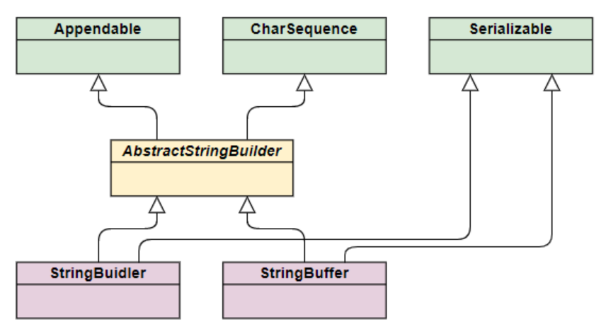

  String a="abc";  String b="abc";  String c=new String("abc");  String d=new String("abc");    System.out.println(a==b);//true  System.out.println(a==c);//false  System.out.println(c==d);a==b;//false   String e=new String("abcd");  //如果常量池里没有abcd就要先在堆里产生一个abcd对象，  //然后堆里再产生一个对象，共两个  //如果常量池里有abcd就只在堆里产生一个对象

a，b都是字符串常量，在创建常量时，首先到字符串常量池里去找，有的话就直接引用，所以a=b；

new是显示的的在堆里创建一个新的对象，创建时先检查字符串常量池里是否有相同的数据，没有的话，就在常量池里先创建一个对象，然后在堆里拷贝一份，有的话直接拷贝一份。堆里的对象和字符串常量池里的对象地址肯定是不同的，所以a！=d。c和d各自在堆里new了一个对象，因此也不相等。

## 6.深拷贝和浅拷贝

浅拷贝：对基本数据类型进行值传递，对引用数据类型（内存地址）进行引用传递般的拷贝，此为浅拷贝。

1、对于基本数据类型，因为基本数据类型是值传递的，所以是直接把属性赋值给新的对象，修改一个对象不会改变另外一个对象的值

2、对于引用类型，比如数组或者对象，引用传递只是把内存地址值赋给了新对象，指向同一内存空间，修改一个会改变另外一个对象

深拷贝：对基本数据类型进行值传递，对引用数据类型，创建⼀个新的对象，开启新空间并复制其内容，此为深拷贝。

1、对于基本数据类型，因为基本数据类型是值传递的，所以是直接把属性赋值给新的对象，修改一个对象不会改变另外一个对象的值（和浅复制一样）

2、对于引用类型，比如数组或者类对象，深拷贝会新建一个对象空间，然后拷贝里面的内容，所以它们指向了不同的内存空间。改变其中一个，不会对另外一个也产生影响。

3、 对于有多层对象的，每个对象都需要实现 Cloneable 并重写 clone() 方法，进而实现了对象的串行层层拷贝。

4、深拷贝相比于浅拷贝速度较慢并且花销较大。

## 7.反射

在运行时，对于某个类知道它的属性和方法，对于任意对象，都可以调用它的方法和属性，这种动态的获取信息和调用对象方法的功能叫反射

反射性能：在大多数情况下没那么好，因为它先去方法区里看它这个类有没有加载过，没有的话有一个类的加载过程

获取反射的三种方法：1.通过new对象实现反射机制 2.通过路径实现反射机制 3.通过类名实现反射机制

反射场景：spring反射，Spring 通过 XML 配置模式装载 Bean 的过程：

1) 将程序内所有 XML 或 Properties 配置文件加载入内存中; 

2)Java类里面解析xml或properties里面的内容，得到对应实体类的字节码字符串以及相关的属性信息;

 3)使用反射机制，根据这个字符串获得某个类的Class实例;

 4)动态配置实例的属性

## 8.堆、栈、队列及应用场景

栈先进后出，后进先出，可以用于字符匹配，数据反转等场景

队列先进先出，可以用于任务队列，共享打印机等场景

堆树形结构，动态分配内存，可以用于优先队列，堆排序等场景

## 9.开启线程的三种方式，优缺点

## 10.BIO、NIO、AIO区别

BIO (Blocking I/O): 同步阻塞I/O模式，数据的读取写入必须阻塞在一个线程内等待其完成。在活动连接数不是特别高（小于单机1000）的情况下，这种模型是比较不错的，可以让每一个连接专注于自己的 I/O 并且编程模型简单，也不用过多考虑系统的过载、限流等问题。线程池本身就是一个天然的漏斗，可以缓冲一些系统处理不了的连接或请求。但是，当面对十万甚至百万级连接的时候，传统的 BIO 模型是无能为力的。因此，我们需要一种更高效的 I/O 处理模型来应对更高的并发量。模式简单使用方便，并发处理能力低。

NIO (New I/O): NIO是一种同步非阻塞的I/O模型，在Java 1.4 中引入了NIO框架，对应 java.nio 包，提供了 Channel , Selector，Buffer等抽象。NIO中的N可以理解为Non-blocking，不单纯是New。它支持面向缓冲的，基于通道的I/O操作方法。 NIO提供了与传统BIO模型中的 Socket 和 ServerSocket 相对应的 SocketChannel 和 ServerSocketChannel 两种不同的套接字通道实现,两种通道都支持阻塞和非阻塞两种模式。阻塞模式使用就像传统中的支持一样，比较简单，但是性能和可靠性都不好；非阻塞模式正好与之相反。对于低负载、低并发的应用程序，可以使用同步阻塞I/O来提升开发速率和更好的维护性；对于高负载、高并发的（网络）应用，应使用 NIO 的非阻塞模式来开发。是传统 IO 的升级，客户端和服务器端通过 Channel（通道）通讯，实现了多路复用

AIO (Asynchronous I/O): AIO 也就是 NIO 2。在 Java 7 中引入了 NIO 的改进版 NIO 2,它是异步非阻塞的IO模型。异步 IO 是基于事件和回调机制实现的，也就是应用操作之后会直接返回，不会堵塞在那里，当后台处理完成，操作系统会通知相应的线程进行后续的操作。AIO 是异步IO的缩写，虽然 NIO 在网络操作中，提供了非阻塞的方法，但是 NIO 的 IO 行为还是同步的。对于 NIO 来说，我们的业务线程是在 IO 操作准备好时，得到通知，接着就由这个线程自行进行 IO 操作，IO操作本身是同步的。是 NIO 的升级，也叫 NIO2，实现了异步非堵塞 IO ，异步 IO 的操作基于事件和回调机制

## 11.try、catch、finally带return的执行顺序总结

没有异常时，try到finally，有异常时，try~catch~finally，finally中的代码总会被执行

当try、catch中有return时，finally没有时，会暂时保存return的值，然后执行执行finally，再把return的值返回

finally中有return时，会执行finally的return，导致try、catch中的return失效

## 12.泛型

泛型，即“参数化类型”。就是将类型由原来的具体的类型参数化，类似于方法中的变量参数，此时类型也定义成参数形式（可以称之为类型形参），然后在使用/调用时传入具体的类型（类型实参）

一些常用的泛型类型变量：

E：元素（Element），多用于java集合框架

K：关键字（Key）

N：数字（Number）

T：类型（Type）

V：值（Value）

# 二、Java集合

## 1.HashMap

**1、1.7和1.8区别**

1.7链表+数组，entry节点，使用头插法，会造成resize扩容过程中调用transfer方法，可能造成链表的死循环。相关阅读：https://coolshell.cn/articles/9606.html

1.8数组+链表+红黑树，node节点，使用尾插法，hash桶默认数量16，负载因子0.75，单链表长度大于等于8并且hash桶大于等于64时将单链表转换成红黑树存储，红黑树节点的数量要是小于等于6的时候，会重新转换成单链表。相关阅读：《Java 8系列之重新认识HashMap》 ：https://zhuanlan.zhihu.com/p/21673805

**2、扩容机制**

loadFactor负载因子0.75（在时间和空间上取得折中），hash桶默认16，那么hash桶占用的容量大于12时，就会触发扩容，hash桶会扩容成之前的两倍，老的元素根据key和value再进行一次hash运算，添加到新的hash桶里，按照链表或者红黑树的形式排列起来

**3、线程不安全**

它线程不安全，在插入操作的时候多线程有数据覆盖的可能，并发高的时候不能保证push进去的值还是push进去的值，另外在1.7的时候它在put的时候还有个resize的过程，造成它的头插会形成一个环形链表导致死循环，为保证线程安全就使用ConcurrentHashMap来保证线程安全（hashtable太重或者collection.synchronized也是重量级锁，性能相对会变差，所以不选）

**4、2的幂次方**

使用2^n是因为可以进行位运算，速度比较快。我们使用HashMap希望不出现存取高效，减少hash碰撞，意思就是让数据分散的更加均匀。Hash 值的范围值-2147483648到2147483647，前后加起来大概40亿的映射空间，只要哈希函数映射得比较均匀松散，⼀般应用是很难出现碰撞的。怎么计算最均匀呢？使用取模运算，hash%length，但是取模计算没有位运算快，在hashmap里使用了hash&（length-1），只有当length=2^n，这个等式才相等。

**5、重写 equals 必须重写 HashCode**

首先为什么重写hashcode，重写hashcode的目的是保证key的唯一性，不重写的话调用object的hashcode方法，相同的key但new了新的对象，那得到的hashcode不同，存放位置就不同，我们的目的是对象逻辑上的相同，而不是地址相同

为什么还要重写equals，重写hashcode方式仅能够表示两个key计算得到的hash值相同，调用get方法的时候会到正确位置寻找，但是当出现hash冲突的时候，同一个位置可能用链表去存放冲突元素，这个时候就要用equals去对比，如果不重写equals方法，它会直接调用Object的equals方法，直接判断内存地址是否一样，但是我们的目的是逻辑上的相等，所以要重写

hashmap判断两个对象（key）规则

先用判断hashcode是否相等，若不相等，则对象不相等，完毕；若相等（对象确实相等或者hash冲突），到下一步

判断equals是否相等，若不相等，则对象不相等，若相等，则相等

**6、put和get方法（工作原理）**

put方法

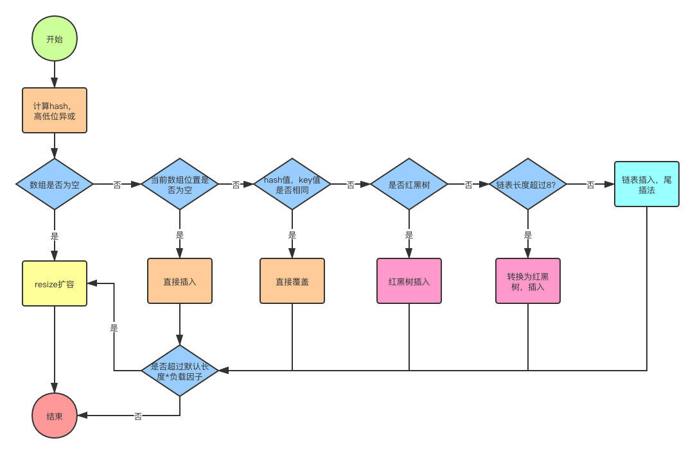

1、判断table是否为空，为空的话执行resize方法扩容

2、根据hash（key）值计算地址，如果该地址没有元素，则把键值对存入，并根据链表长度决定是否将链表转化成红黑树

3、如果该地址有值且equals返回true，直接替换掉，如果equals返回fasle，则插入链表尾部，链表长度超过8的话就转换红黑树

4、判断键值对数量是否大于阈值（长度*负载因子），大于的话则进行扩容操作

get方法

1、根据key的hashcode算出下标，没有就返回空，有就遍历对象链表，找到元素返回

## 2.HashMap 和 Hashtable 的区别

\1. 线程是否安全： HashMap 是非线程安全的，HashTable 是线程安全的；HashTable 内部的⽅法基本都经过 synchronized 修饰。HashTable 是个过时的集合，不要在代码中使用它，如果要保证线程安全的话就使用 ConcurrentHashMap ！； 

\2. 效率： 因为线程安全的问题，HashMap 要比 HashTable 效率⾼⼀点。 

\3. 对Null key 和Null value的支持： HashMap 中，null 可以作为键，这样的键只有⼀个，可以有⼀个或多个键所对应的值为 null。但是在 HashTable 中 put 进的键值只要有⼀个 null， 直接抛出 NullPointerException。

\4. 初始容量大小和每次扩充容量大小的不同 ： ①创建时如果不指定容量初始值，Hashtable 默认 的初始大小为11，之后每次扩充，容量变为原来的2n+1。HashMap 默认的初始化大小为16。之后 每次扩充，容量变为原来的2倍。②创建时如果给定了容量初始值，那么 Hashtable 会直接使用你给定的大小，而HashMap 会将其扩充为2的幂次方大小（HashMap 中的 tableSizeFor() 方法保证，下面给出了源代码）。也就是说 HashMap 总是使用2的幂作为哈希表的大小,后面会介绍到为什么是2的幂次方。 

\5. 底层数据结构： JDK1.8 以后的 HashMap 在解决哈希冲突时有了较大的变化，当链表长度大于阈值（默认为8）时，将链表转化为红黑树，以减少搜索时间。Hashtable 没有这样的机制。 

HashMap 中带有初始容量的构造函数：

public HashMap(int initialCapacity, float loadFactor) {     if (initialCapacity < 0)         throw new IllegalArgumentException("Illegal initial capacity: " + initialCapacity);     if (initialCapacity > MAXIMUM_CAPACITY)         initialCapacity = MAXIMUM_CAPACITY;     if (loadFactor <= 0 || Float.isNaN(loadFactor))         throw new IllegalArgumentException("Illegal load factor: " + loadFactor);         this.loadFactor = loadFactor;         this.threshold = tableSizeFor(initialCapacity);  }  public HashMap(int initialCapacity) {     this(initialCapacity, DEFAULT_LOAD_FACTOR);  }

下面这个方法保证了 HashMap 总是使⽤2的幂作为哈希表的大小。

/**  * Returns a power of two size for the given target capacity.  */  static final int tableSizeFor(int cap) {     int n = cap - 1;     n |= n >>> 1;     n |= n >>> 2;     n |= n >>> 4;     n |= n >>> 8;     n |= n >>> 16;     return (n < 0) ? 1 : (n >= MAXIMUM_CAPACITY) ? MAXIMUM_CAPACITY : n + 1;  }

## 3.HashMap 和 HashSet区别

HashSet 底层就是基于 HashMap实现的。HashSet 的 源码非常非常少，因为除了 clone() 、 writeObject() 、 readObject() 是 HashSet 自己不得不实现之外，其他方法都是直接调用HashMap 中的方法。

| HashMap                          | HashSet                                                      |
| -------------------------------- | ------------------------------------------------------------ |
| 实现了Map接口                    | 实现Set接口                                                  |
| 存储键值对                       | 仅存储对象                                                   |
| 调用 put（）向map中添加元素      | 调用 add（）方法向Set中添加元素                              |
| HashMap使用键（Key）计算Hashcode | HashSet使用成员对象来计算hashcode值，对于两个对象来说hashcode可能相同，所以equals()方法用来判断对象的相等性 |

## 4.HashSet如何检查重复

当你把对象加⼊ HashSet 时，HashSet会先计算对象的 hashcode 值来判断对象加⼊的位置，同时也会与其他加入的对象的hashcode值作比较，如果没有相符的hashcode，HashSet会假设对象没有重复出现。但是如果发现有相同hashcode值的对象，这时会调⽤ equals（） 方法来检查hashcode相等的对象是否真的相同。如果两者相同，HashSet就不会让加入操作成功。（摘自《Head fist java》第⼆版） 

hashCode（）与equals（）的相关规定： 

\1. 如果两个对象相等，则hashcode⼀定也是相同的 

\2. 两个对象相等,对两个equals⽅法返回true 

\3. 两个对象有相同的hashcode值，它们也不⼀定是相等的 

\4. 综上，equals⽅法被覆盖过，则hashCode⽅法也必须被覆盖 

\5. hashCode()的默认⾏为是对堆上的对象产⽣独特值。如果没有重写hashCode()，则该class的两 个对象无论如何都不会相等（即使这两个对象指向相同的数据）。 

==与equals的区别 

\1. ==是判断两个变量或实例是不是指向同一个内存空间 equals是判断两个变量或实例所指向的内存空间的值是不是相同 

\2. ==是指对内存地址进行比较 equals()是对字符串的内容进行比较

\3. ==指引用是否相同 equals()指的是值是否相同

## 5.ConcurrentHashMap 和 Hashtable 的区别

ConcurrentHashMap 和 Hashtable 的区别主要体现在实现线程安全的方式上不同。

底层数据结构：JDK1.7的 ConcurrentHashMap 底层采用分段的数组+链表 实现，JDK1.8 采用的数据结构跟HashMap1.8的结构⼀样，数组+链表/红黑二叉树。Hashtable 和 JDK1.8 之前的 HashMap 的底层数据结构类似都是采用数组+链表 的形式，数组是 HashMap 的主体，链表则是主要为了解决哈希冲突而存在的； 

**实现线程安全的方式（重要**）： ① 在JDK1.7的时候，ConcurrentHashMap（分段锁） 对整个桶数组进行了分割分段(Segment)，每⼀把锁只锁容器其中⼀部分数据，多线程访问容器里不同数据段的数据，就不会存在锁竞争，提⾼并发访问率。 到了 JDK1.8 的时候已经摒弃了Segment的概念，而是直接用Node数组+链表+红⿊树的数据结构来实现，并发控制使用synchronized 和 CAS 来操作。（JDK1.6以后 对 synchronized锁做了很多优化） 整个看起来就像是优化过且线 程安全的 HashMap，虽然在JDK1.8中还能看到 Segment 的数据结构，但是已经简化了属性，只 是为了兼容旧版本；② Hashtable(同⼀把锁) :使用synchronized 来保证线程安全，效率非常低下。当一个线程访问同步方法时，其他线程也访问同步方法，可能会进⼊阻塞或轮询状态，如使用 put 添加元素，另⼀个线程不能使用put 添加元素，也不能使用 get，竞争会越来越激烈效率越低。

ConcurrentHashMap 实现原理及源码分析：http://www.cnblogs.com/chengxiao/p/6842045.html

## 6.ConcurrentHashMap

**1、1.7和1.8区别**

1.7底层数据结构是分片数组，为保证线程安全有个Segment锁，它继承自ReentrantLock，每次只给一段加速老保证并发度。Segment的意义就在于将一个大的table分成很多小的table来进行加锁，相当于每个Segment都是一个HashMap，每一个Segment元素存储的是数据+链表，1.7的get和put要进行两次hash，第一次定位到segment，第二次定位到数组，所以找到具体的值需要两次哈希

1.8改成了和hashmap一样的数据结构，Node数组+链表+红黑树，同时放弃了分片锁机制，使用synchronized 和 CAS来保证并发度，保证它的线程安全

**2、什么是CAS？乐观锁、悲观锁，Atomic类通过cas保证原子性**

什么是CAS？compare and swap，比较和交换，优点是轻量级。它是一种基于乐观锁的操作，它包含三个操作数，内存原值V(需要更新的值)，预期值E和准备设置的新值N，如果V=E，就把V修改成N，否则就不更新值，继续上述过程。可能导致ABA问题（无法发现中间改成B又改回A，用版本号解决，因为java提供了一个包标记的原子引用类AtomicStampedReference，用的很少大部分不无影响）、CPU开销增大（循环判断，一直不成功就会一直比较）、只能保证一个变量的原子性(解决办法是考虑将这些共享变量封装为一个对象)

它的实际应用：并发包、并发修改、底层源码

乐观锁：假设不会发生并发冲突,只有在最后更新共享资源的时候会判断一下在此期间有没有别的线程修改了这个共享资源。如果发生冲突就重试，直到没有冲突，更新成功

悲观锁：假定会发生并发冲突，即共享资源会被某个线程更改。所以当某个线程获取共享资源时，会阻止别的线程获取共享资源。也称独占锁或者互斥锁，例如java中的synchronized同步锁

不允许key和value为空，hashmap允许

**3、1.7put方法和get方法**

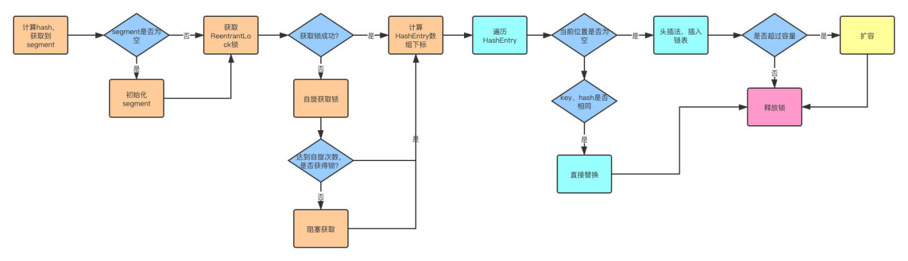

put和hashmap相似，区别是先定位到segment，然后通过lock去操作

1、计算hash，定位到segment，segment如果是空就先初始化

2、使用ReentrantLock加锁，如果获取锁失败则尝试自旋，自旋超过次数就阻塞获取，保证一定获取锁成功

3、遍历HashEntry，就是和HashMap一样，数组中key和hash一样就直接替换，不存在就再插入链表，链表同样

get：key通过hash定位到segment，再遍历链表定位到具体的元素上，需要注意的是value是volatile的，所以get是不需要加锁的

**4、1.8put方法和get方法**

put：

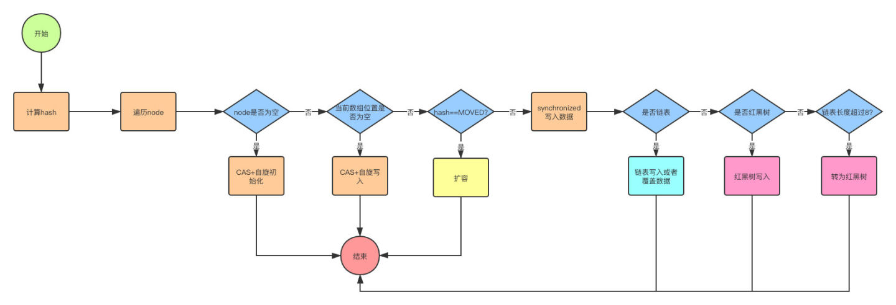

1、首先计算hash，遍历node数组，如果node是空的话，就通过CAS+自旋的方式初始化

2、如果当前数组位置是空则直接通过CAS自旋写入数据

3、如果hash==MOVED，说明需要扩容，执行扩容

4、如果都不满足，即节点不为空也不扩容，就使用synchronized锁一个table写入数据，写入数据同样判断链表、红黑树，链表写入和HashMap的方式一样，key hash一样就覆盖，反之就尾插法，链表长度超过8就转换成红黑树

get：get很简单，通过key计算hash，如果key hash相同就返回，如果是红黑树按照红黑树获取，都不是就遍历链表获取

1.8源码分析https://www.cnblogs.com/banjinbaijiu/p/9147434.html

## 7.ArrayList

原理：底层是数组，初始化的时候数据量是0，当add时默认变成10，扩容每次是之前的1.5倍，根据脚标查询所以查询快

特性（场景）：查询速度快，增删效率低，线程不安全

为什么查询速度快呢？支持随机访问，直接用下标就可以访问了

为什么增删效率低呢？增加或者删除的时候，后面的数都需要进行移动。数据量很大的时候，移动可能需要很大的开销

如果考虑线程安全可以使用Vector，和Arraylist一样底层都是数组，但是大部分方法用了synchronized关键字修饰，所以说它是线程安全的，它的扩容是2倍扩容

和数组的区别：数组内存地址连续，索引速度很快，但是必须指定长度，短了可能导致数据溢出，长了浪费空间，而ArrayList是可变的，但是类型不安全，即可以插入字符又插入数字，使用时报类型不匹配错误，使用时就需要类型转换，进行装箱拆箱，造成性能损耗

高并发List：CopyOnWriteArrayList

## 8.LinkList

原理：底层是带有头结点和尾节点的双向链表，提供头插和尾插，内部维护了链表长度

特性（场景）：增删效率高，在数据量大时查询比较慢

为什么查询会比较慢呢？它是个链表，指针要一个节点一个节点的遍历下去，不支持随机访问。所以查询慢。当然在数据量比较小的时候，和ArrayList的效率都差不多

为什么增删快呢？它删除或者增加的时候只需要将指针重新指向一个节点就行了

# 三、并发编程（多线程）

## 1.谈谈Volatile

Volatile是JVM提供的轻量级的同步机制

1、保证可见性（可见性指线程之间的可见性，一个线程修改的状态某个值对另外一个线程可见），讲讲可见性的原理

线程都是从主内存读取变量到工作内存来操作，完成后再写会主内存，这就产生了问题。

假设我们有两级缓存L1和L2，开始缓存都是空的，线程A先读取主内存变量X的值（假设为），线程A 使用之后把X修改为1，同时写会主内存，此时情况入下

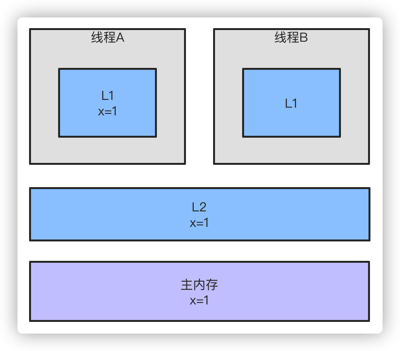

同时线程B也读取变量X的值，L2有X的值了，就直接读取，使用后修改为2，假设线程A再使用X，他的L1缓存里有x的值，就不会去L2读，使用了一个错误的值

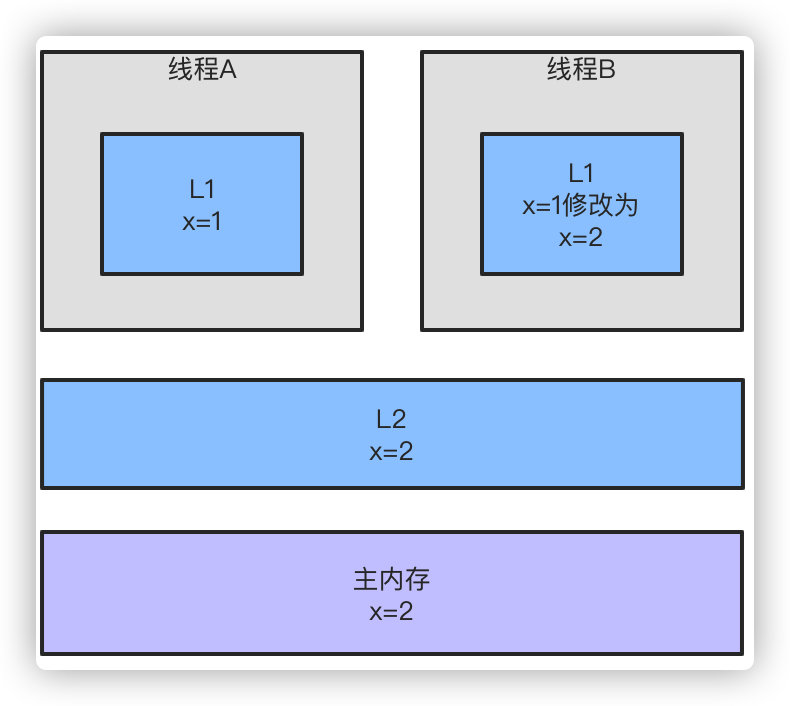

volatile的目的就是线程A再次读取变量时必须从主内存去加载最新的值到工作内存，而不是直接使用缓存的值

2、保证有序性，禁止指令重排，如何保证禁止指令重排？通过内存屏障。

内存屏障有四种：

StoreStore屏障，保证上面的普通写不和volatile写发生重排序

StoreLoad屏障，保证volatile写与后面可能的volatile读写不发生重排序

LoadLoad屏障，禁止volatile读与后面的普通读重排序

LoadStore屏障，禁止volatile读和后面的普通写重排序

有读屏障和写屏障，作用是

1.阻止屏障两侧的指令重排序；

2.强制把写缓冲区/高速缓存中的脏数据等写回主内存，让缓存中相应的数据失效

volatile的内存屏障策略：

1、在每个volatile写操作前插入StoreStore屏障，在写操作后插入StoreLoad屏障；

2、在每个volatile读操作前插入LoadLoad屏障，在读操作后插入LoadStore屏障；

3、不保证原子性（需要借助synchronized或者CAS)

底层实现：被volatile修饰的变量在进行写操作时，会生成一个特殊的汇编指令，该指令会触发mesi协议，会存在一个总线嗅探机制的东西，这个cpu会不停检测总线中该变量的变化，如果该变量一旦变化了，由于这个嗅探机制，其它cpu会立马将该变量的cpu缓存数据清空掉，重新的去从主内存拿到这个数据。但是总线不断的进行嗅探也会导致占用资源过大的问题，总线风暴？

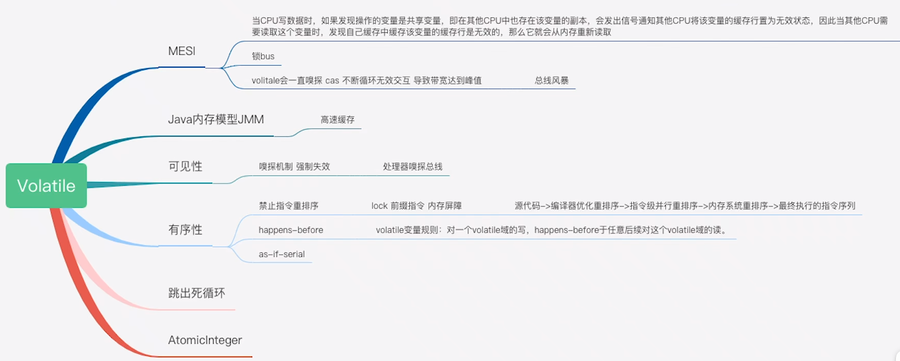

## 2.谈谈 synchronized

synchronized关键字解决的是多个线程之间访问资源的同步性，synchronized关键字可以保证被它修饰的方法或者代码块在任意时刻只能有一个线程执行。同时synchronized可以保证一个线程变化的可见性；

**特性：**保证了有序性、可见性、原子性、可重入性

**使用方式**

1、修饰实例方法，对当前对象实例加锁，进入同步代码前要获得当前对象实例的锁，锁的是当前实例对象；

2、修饰静态方法，对当前类对象加锁，进入同步代码前要获得当前类对象的锁；当给当前类对象加锁的时候会作用于这个类的所有实例，静态成员不属于某一个实例，而是这个类的成员，此时加锁在类对象指的是，锁的是当前类的Class对象，所有的对象实例化都是通过这一个模板生成的，此时把这个模板锁住了，在实例化新对象的时候就需要先获得锁；

3、修饰代码块，指定加锁对象，锁是 synchronized 括号里配置的对象，对给定对象加锁，进入同步代码块前要获得给定对象的锁，synchronized (this) 代码块的锁是加在了实例对象上，synchronized (class) 代码块的锁是加在了Class类对象上；

同步代码块原理：使用monitorenter和monitorexit指令实现的。执行monitorenter的时候会尝试获取对象锁，如果对象没有被锁定或者已经获得了锁，把锁的计数器+1（可重入，获得锁的话不用等它释放锁再加锁，直接+1即可），其他竞争的线程进入等待队列。monitorexit的时候计数器-1，计数器为0的时候就释放锁，等待队列里面的线程继续竞争锁

同步方法（JVM底层实现）依靠方法修饰符上的ACC_SYNCHRONIZED实现

**锁膨胀/锁的优化机制（1.6后升级比较大）**

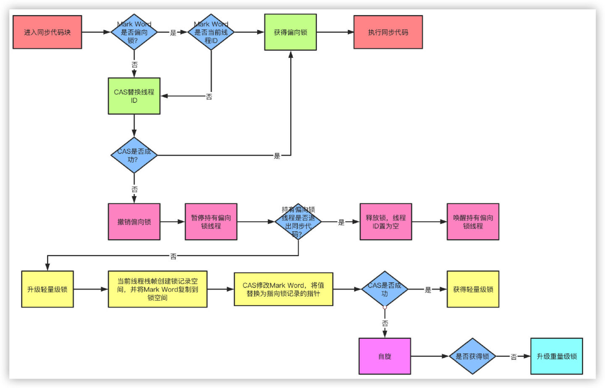

1、无锁：一开始判断一下状态，是无锁的

2、偏向锁：偏向获得第一个锁的进程，将线程拉到锁对象的对象头里，其他线程来的时候就立刻结束偏向状态，转向轻量级锁，在mark word里记录的是线程ID，如果是当前线程ID就偏向当前线程

3、轻量级：用于低并发，虚拟机先建立一个lock recode，用来存储mark word，然后使用CAS操作去把mark word更新给lock recod，成功的话就对象头里的状态位标记为轻量级锁。当轻量级级锁设置不成功，自旋，自旋到一定次数之后还不成功说明竞争比较激烈，就升级成重量级锁。

4、重量级

自旋锁：由于大部分时候，锁被占用的时间很短，共享变量的锁定时间也很短，所有没有必要挂起线程，用户态和内核态的来回上下文切换严重影响性能。自旋的概念就是让线程执行一个忙循环，可以理解为就是啥也不干，防止从用户态转入内核态，自旋锁可以通过设置-XX:+UseSpining来开启，自旋的默认次数是10次，可以使用-XX:PreBlockSpin设置。

自适应锁：自适应锁就是自适应的自旋锁，自旋的时间不是固定时间，而是由前一次在同一个锁上的自旋时间和锁的持有者状态来决定。

锁消除：锁消除指的是JVM检测到一些同步的代码块，完全不存在数据竞争的场景，也就是不需要加锁，就会进行锁消除。

锁粗化：锁粗化指的是有很多操作都是对同一个对象进行加锁，就会把锁的同步范围扩展到整个操作序列之外。

**synchronized和ReentrantLock（Lock）区别**

ReentrantLock三高级特性，如果不使用这三特性还是用synchronized

1、等待可中断，当我长期得不到一个锁的时候，我可以放弃等待，释放资源去处理其他事情

2、可以实现公平锁（先等待的线程先获得锁），它默认是非公平锁，但是它可以通过它的构造函数来指定是否公平，但是不推荐使用，它会让ReentrantLock的性能急剧下降，明显影响吞吐量

3、可以同时绑定多个condition，可以指定去唤醒绑定到condition上的线程来实现选择性通知的机制

除了这三个特性，还有区别就是

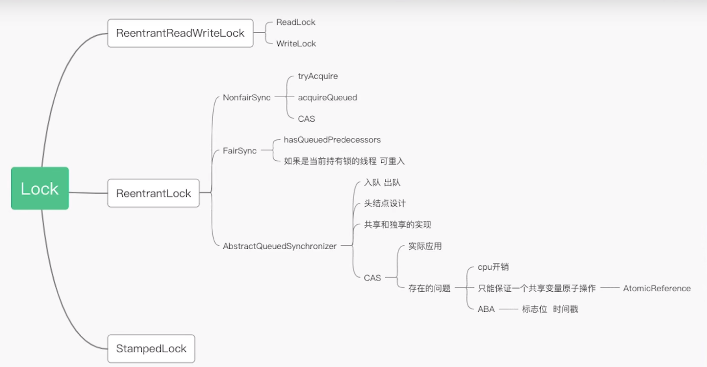

1、synchronized是JVM的一个关键字，使用起来比较方便，直接同步代码块或者方法，不用关心锁的释放，ReentrantLock是一个类，需要手动去编码手动去lock，再配合代码块try/finally去释放锁。例如synchronized发生异常自动释放锁，Lock要手动解锁

2、synchronized不可中断，Lock可中断

3、都是可重入锁，可重锁就是当一个线程获取到了某个对象的锁，它想要再次获取这个对象的锁还是可以获取的，如果不可重入的会造成死锁，同时性能不是选择标准

ReentrantLock基于AQS实现，讲讲AQS原理

## 3.说说 synchronized和 volatile的区别

1、volatile关键字是线程同步的轻量级实现，所以volatile性能肯定比synchronized关键字要好。

但是volatile关键字只能用于变量而synchronized关键字可以修饰方法以及代码块。synchronized关键字在JavaSE1.6之后进⾏了主要包括为了减少获得锁和释放锁带来的性能消耗而引入的偏向锁和轻量级锁以及其它各种优化之后执行效率有了显著提升，实际开发中使用synchronized 关键字的场景还是更多⼀些。

2、多线程访问volatile关键字不会发生阻塞，而synchronized关键字可能会发生阻塞

volatile关键字能保证数据的可见性，但不能保证数据的原子性。synchronized关键字两者都能保证。

3、volatile关键字主要用于解决变量在多个线程之间的可见性，而synchronized关键字解决的是多个线程之间访问资源的同步性。

## 4.进程和线程的区别

根本区别：进程是操作系统资源分配的基本单位，而线程是任务调度和执行的基本单位

进程是运行的程序，每启动一个进程，系统就为它分配地址空间，一个进程包含多个线程。线程是进程的一个实体，自己基本上不拥有系统资源，同属一个进程的线程共享进程的资源。

## 5.进程如何通信？线程如何通信？

进程通过管道、套接字、信号、信号量、共享内存、消息队列进行通信。

1、管道/匿名管道(Pipes) ：用于具有亲缘关系的父子进程间或者兄弟进程之间的通信，半双工，只存在于内存里

2、有名管道(Names Pipes) :严格遵循先进先出(first in first out)。有名管道以磁盘文件的方式存在，可以实现本机任意两个进程通信。对比：匿名管道没有名字，只能用于亲缘关系的进程间通信。

3、信号(Signal) ：信号是⼀种比较复杂的通信方式，用于通知接收进程某个事件已经发生； 

4、消息队列(Message Queuing) ：消息队列是消息的链表,具有特定的格式,存放在内存中由标识符（队里ID）标识。管道和消息队列的通信数据都是先进先出的原则。与管道（无名管道：只存在于内存中的文件；命名管道：存在于实际的磁盘介质或者文件系统）不同的是消息队列存放在内核中，只有在内核重启(即，操作系统重启)或者显示地删除⼀个消息队列时，该消息队列才会被真正的删除。消息队列可以实现消息的随机查询,消息不一定要以先进先出的次序读取,也可以按消息的类型读取.比FIFO 更有优势。消息队列克服了信号承载信息量少，管道只能承载无格式字节流以及缓冲区大小受限等缺。 

5、信号量(Semaphores) ：信号量是一个计数器，用于多进程对共享数据的访问，信号量的意图在于进程间同步。这种通信方式用于实现进程间的互斥与同步，而不是用于存储进程间通信数据 

6、共享内存(Shared memory) ：使得多个进程可以访问同一块内存空间，不同进程可以及时看到对方进程中对共享内存中数据的更新。共享内存要保持同步，如互斥锁和信号量等。可 以说这是最有用的进程间通信方式。 信号量+共享内存结合使用

7、套接字(Sockets) : 此方法主要用于在客户端和服务器之间通过网络进行通信。套接字是支持 TCP/IP 的网络通信的基本操作单元，可以看做是不同主机之间的进程进行双向通信的端点，简单的说就是通信的两方的一种约定，用套接字中的相关函数来完成通信过程。

线程通信方式有volatile、等待/通知机制（wait/notify）、join方式、threadLocal，从共享内存角度谈

## 6.线程基本状态或者说线程生命周期（6种）

Java线程有6种生命状态，打开Thread源码可以看到

1、NEW 状态（new）

初始状态，线程被构建，但是还没有调用start（）方法。

用 new Thread() 建立一个线程对象后，该线程对象就处于 NEW 状态。

2、RUNNABLE 状态（runnable）

运行状态，Java系统系统中将操作系统中的就绪和运行两种状态笼统地称为“运行中”

通过调用线程的 start() 进入 RUNNABLE 状态。

在操作系统层面，对 RUNNABLE 状态还有细分，按是否有获得 CPU 的控制权分为：READY 和 RUNNING 状态。

2.1  READY 状态（reday）

处于 READY 状态的线程已经具备了运行条件，但还没有分配到CPU，处于线程就绪队列（就绪池），等待系统为其分配CPU。注：如果希望子线程调用 start() 方法后立即执行，可以使用Thread.sleep()方式使主线程睡眠一伙儿，转去执行子线程。

2.2 RUNNING 状态（running）

线程处于运行状态。这个状态最为复杂，它也可和其他状态进行转化，转化的示意图如下图。注: 在运行状态的线程调用 yield()，它就会让出cpu资源，再次变为就绪状态。

\3. WAITING 状态（waiting）

等待状态，表示线程进入等待状态，进入该状态表示当前线程做出一些特定动作（通知或者中断）

\4. TIMED_WAITING 状态（timed-waiting）

超时等待状态，该状态不同于等待状态，它可以在指定的时间后自行返回

注：处于 TIMED_WAITING  状态的线程，除了等待超时时间到后结束等待外，还可以通过调用相应的唤醒方法：notify(),notifyAll(),unpark()，来强制唤醒等待的线程。

5、BLOCKED 状态（blocked）

阻塞状态，表示线程阻塞于锁

当线程在等待获取对象监视器锁，从而进入 synchronized 方法（或synchronized 块）时，线程就处于 BLOCKED 状态。（具体可以查看 Thread.State#BLOCKED 的注释）

6、TEMINATED 状态（teminated）

中止状态，表示当前线程已经执行完毕

当线程的 run() 执行完，或者被强制性地终止，例如出现异常，或者调用了stop()、desyory()方法等等，就会从运行状态转变为死亡状态。

线程一旦死亡，就不能复生。如果在一个死去的线程上调用start()方法，会抛出java.lang.IllegalThreadStateException异常。

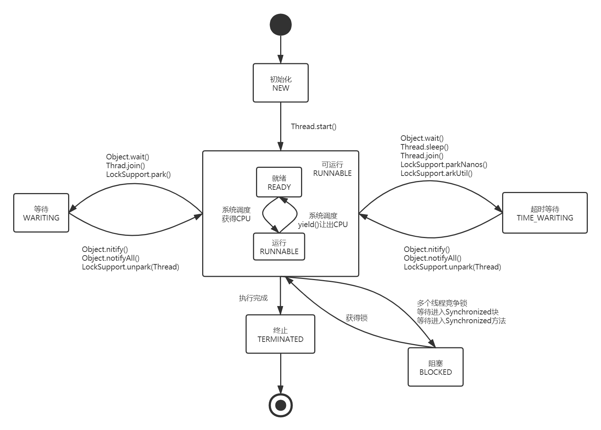

操作系统层面是5种

初始状态(New)、可运行状态(Runnable)、运行状态(Running)、阻塞状态(Blocked)、死亡状态(Dead)

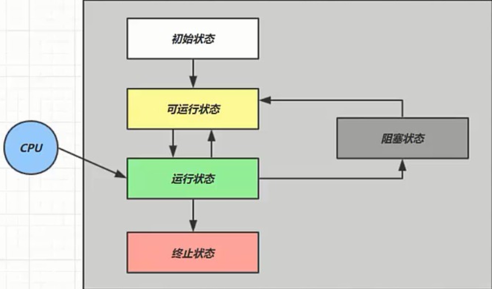

## 7.线程同步方式

1、临界区（Critical Section）:通过对多线程的串行化来访问公共资源或一段代码，速度快，适合控制数据访问。

优点：保证在某一时刻只有一个线程能访问数据的简便办法

缺点：虽然临界区同步速度很快，但却只能用来同步本进程内的线程，而不可用来同步多个进程中的线程。

2、互斥量（Mutex）:为协调共同对一个共享资源的单独访问而设计的，采用互斥对象机制，只有拥有互斥对象的线程才有访问公共资源的权限。因为互斥对象只有一个，所以可以保证公共资源不会被多个线程访问。比如Java中的syncharonized关键词和各种Lock。

优点：使用互斥不仅仅能够在同一应用程序不同线程中实现资源的安全共享，而且可以在不同应用程序的线程之间实现对资源的安全共享。

缺点：①互斥量是可以命名的，也就是说它可以跨越进程使用，所以创建互斥量需要的资源更多，所以如果只为了在进程内部是用的话使用临界区会带来速度上的优势并能够减少资源占用量。因为互斥量是跨进程的互斥量一旦被创建，就可以通过名字打开它。

②通过互斥量可以指定资源被独占的方式使用，但如果有下面一种情况通过互斥量就无法处理，比如现在一位用户购买了一份三个并发访问许可的数据库系统，可以根据用户购买的访问许可数量来决定有多少个线程/进程能同时进行数据库操作，这时候如果利用互斥量就没有办法完成这个要求，信号量对象可以说是一种资源计数器。

3、信号量（Semaphore）:为控制一个具有有限数量用户资源而设计。它允许多个线程在同一时刻访问同一资源，但是需要限制在同一时刻访问此资源的最大线程数目。互斥量是信号量的一种特殊情况，当信号量的最大资源数=1就是互斥量了。

优点：适用于对Socket（套接字）程序中线程的同步。（例如，网络上的HTTP服务器要对同一时间内访问同一页面的用户数加以限制，只有不大于设定的最大用户数目的线程能够进行访问，而其他的访问企图则被挂起，只有在有用户退出对此页面的访问后才有可能进入。）

缺点：①信号量机制必须有公共内存，不能用于分布式操作系统，这是它最大的弱点；

②信号量机制功能强大，但使用时对信号量的操作分散， 而且难以控制，读写和维护都很困难，加重了程序员的编码负担；

③核心操作P-V分散在各用户程序的代码中，不易控制和管理，一旦错误，后果严重，且不易发现和纠正。

4、事件（Event）: Wait/Notify用来通知线程有一些事件已发生，从而启动后继任务的开始。

优点：事件对象通过通知操作的方式来保持线程的同步，并且可以实现不同进程中的线程同步操作。

总结：

①临界区不是内核对象，只能用于进程内部的线程同步，是用户方式的同步。互斥、信号量是内核对象可以用于不同进程之间的线程同步（跨进程同步）。

②互斥其实是信号量的一种特殊形式。互斥可以保证在某一时刻只有一个线程可以拥有临界资源。信号量可以保证在某一时刻有指定数目的线程可以拥有临界资源。

## 8.线程池

为什么使用线程池？在java里，如果每个请求到达就创建一个新线程，开销很大，因此我们使用线程池，减少创建和销毁线程的次数，让每个线程可以多次使用,可根据系统情况调整执行的线程数量，防止消耗过多内存

**1、runnable接口和callable接口的区别**

Runnable接口不会返回结果或者抛出检查异常，callable会返回结果，无法得到结果则抛出异常

**2、execute（）方法和submit（）方法的区别**

execute（）方法用于提交不需要返回值的任务，所以无法判断任务是否被线程池执行成功

submit（）方法用于提交需要返回值的任务，线程池会返回一个Future对象，可以判断是否执行成功，通过Future对象的get方法获取返回值

**3、ThreadPoolExecutor类核心参数**

corePoolSize：核心线程数，定义了线程池最少同时运行线程的数量，假如小于这个值，有新任务加入不会使用空闲线程，而是直接用新线程

maximumPoolSize：线程池最大线程数

workQueue：阻塞队列，当线程数量已到核心线程数，新任务会放到队列里面等待

keepAliveTime：当线程数量大于corePoolSize时，空闲线程最多能够存活的时间

threadFactory：线程工厂，主要用来创建线程

handler：任务饱和拒绝策略，四种，ThreadPoolExecutor.AbortPolicy:丢弃任务并抛出RejectedExecutionException异常，默认的策略

ThreadPoolExecutor.DiscardPolicy：丢弃任务，但是不抛出异常。 

ThreadPoolExecutor.DiscardOldestPolicy：丢弃队列里最早的任务，然后重新尝试执行当前任务（重复此过程）

ThreadPoolExecutor.CallerRunsPolicy：由调用线程处理该任务 

**4、执行原理（过程）**

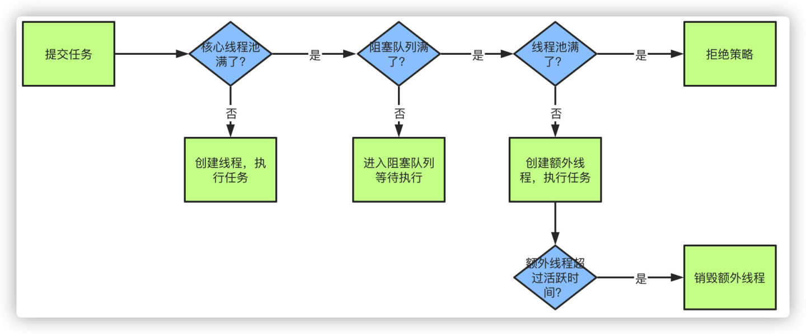

新任务递交后，先判断线程数是否达到corePoolSize，小于则创建线程，否则尝试添加到任务缓存队列

任务添加成功则则等待空闲线程执行，失败（说明任务队列已满）则尝试创建新线程执行任务

如果当前线程数达到maximumPoolSize，则采取任务拒绝策略

线程池里的线程数量大于corePoolSize时，空闲线程超过keepAliveTime则终止空闲线程

## 5.线程池大小选择场景

CPU密集型，一般为CPU核心数+1，CPU密集型任务CPU使用率很高，因此可以设置的小点，若开很多的线程，会造成CPU过度切换

IO密集型，一般为2*CPU核心数，IO密集型的CPU使用率不高，在等待IO时可以让CPU处理其他任务，充分利用CPU

## 6.为什么使用阻塞队列、两种阻塞队列

保证没有任务时阻塞获取任务的线程，释放CPU资源，有任务时再唤醒线程

线程如果无限制创建，CPU或过度切换，内存占用过多可能产生OOM

有界阻塞队列：

无界阻塞队列：

## 7.线程池优势

降低系统资源消耗，通过重用已存在的线程，降低线程创建和销毁造成的消耗；

提高系统响应速度，当有任务到达时，通过复用已存在的线程，无需等待新线程的创建便能立即执行；

方便线程并发数的管控。因为线程若是无限制的创建，可能会导致内存占用过多而产生OOM，并且会造成cpu过度切换（cpu切换线程是有时间成本的（需要保持当前执行线程的现场，并恢复要执行线程的现场））。

提供更强大的功能，延时定时线程池

## 8.Java 常用的 4 种线程池

newCachedThreadPool

创建可缓存的线程，底层是依靠 SynchronousQueue 实现的，创建线程数量几乎没有限制（最大为 Integer.MAX_VALUE）。

如果长时间没有往线程池提交任务，即如果工作线程空闲了指定时间（默认1分钟），该工作线程自动终止。终止后如果又有了新的任务，则会创建新的线程。

在使用 CachedTreadPool 时，要注意控制任务数量，否则由于大量线程同时运行，很有可能造成系统瘫痪

newFixedThreadPool

创建指定数量的工作线程，底层是依靠 LinkedBlockingQueue 实现的，没提交一个任务就创建一个工作线程，当工作线程数量达到线程池初始的最大数，则将提交的任务存入到池队列中。

在线程空闲时，不会释放工作线程，还会占用一定的系统资源

newSingleThreadExecutor

创建单线程，底层是 LinkedBlockingQueue 实现的，它只会用一个工作线程来执行任务，保证所有的任务按指定顺序执行。如果这个线程异常结束，会有另一个取代它，保证顺序执行。

最大的特点是可保证顺序地执行各个任务，并在任意时间是不会有过个线程活动的

newScheduleThreadPool

创建一个定长的线程池，支持定时以及周期性的任务调度

## 9.线程安全的4种实现方式

1、synchronized锁（偏向锁，轻量级锁，重量级锁）

2、volatile锁，只能保证线程之间的可见性，但不能保证数据的原子性

3、并发包中提供的Atomic原子类

4、Lock锁

## 10.创建线程的方式

主要的三种

1、继承Thread类

定义一个类继承继承于Java.lang.Thread类，然后重写run方法，run方法里写线程要执行的任务，然后再main方法里创建对象启动线程：

(1)创建线程类对象:                

A类   a  =  new   A类();

(2)调用线程对象的start方法:    

a.start();//启动一个线程

//1):定义一个类A继承于java.lang.Thread类.   class MusicThread extends Thread{      //2):在A类中覆盖Thread类中的run方法.      public void run() {          //3):在run方法中编写需要执行的操作          for(int i = 0; i < 5; i ++){              System.out.println("播放音乐"+i);          }      }   }     public class ExtendsThreadDemo {      public static void main(String[] args) {                    for(int j = 0; j < 50; j ++){              System.out.println("运行游戏"+j);              if(j == 10){                  //4):在main方法(线程)中,创建线程对象,并启动线程.                  MusicThread music = new MusicThread();                  music.start();              }          }      }     }  

2、实现Runnable接口

1):定义一个类A实现于java.lang.Runnable接口,注意A类不是线程类.

2):在A类中覆盖Runnable接口中的run方法.

3):我们在run方法中编写需要执行的操作：run方法里的,线程执行体.

4):在main方法(线程)中,创建线程对象,并启动线程.

​     (1)创建线程类对象:

​     Thread  t = new Thread(new  A());    

​     (2)调用线程对象的start方法:

​     t.start();

//1):定义一个类A实现于java.lang.Runnable接口,注意A类不是线程类.   class MusicImplements implements Runnable{      //2):在A类中覆盖Runnable接口中的run方法.      public void run() {          //3):在run方法中编写需要执行的操作          for(int i = 0; i < 50; i ++){              System.out.println("播放音乐"+i);          }                }   }     public class ImplementsRunnableDemo {      public static void main(String[] args) {          for(int j = 0; j < 50; j ++){              System.out.println("运行游戏"+j);              if(j == 10){                  //4):在main方法(线程)中,创建线程对象,并启动线程                  MusicImplements mi = new MusicImplements();                  Thread t = new Thread(mi);                  t.start();              }          }      }     }  

分析继承方式和实现方式的区别:

继承方式:

​                1):从设计上分析，Java中类是单继承的,如果继承了Thread了,该类就不能再有其他的直接父类了.

​                2):从操作上分析,继承方式更简单,获取线程名字也简单.(操作上,更简单)

​                3):从多线程共享同一个资源上分析,继承方式不能做到.

实现方式:

​                1):从设计上分析，Java中类可以多实现接口,此时该类还可以继承其他类,并且还可以实现其他接口，设计更为合理.

​                2):从操作上分析,实现方式稍微复杂点,获取线程名字也比较复杂,得使用Thread.currentThread()来获取当前线程的引用.

​               3):从多线程共享同一个资源上分析,实现方式可以做到(是否共享同一个资源).

补充：实现方式获取线程名字：

String name = Thread.currentThread().getName();

3、覆写Callable接口实现多线程

使用线程池的方式

使用内部类的方式

定时器，JDK提供了Timer类来帮助开发者创建定时任务

使用Spring来实现多线程

## 11.AQS原理

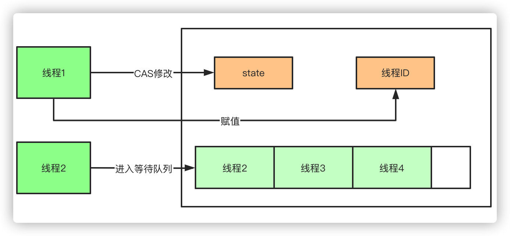

AQS(AbstractQueuedSynchronizer 抽象队列同步器)

AQS内部维护一个state状态位，尝试加锁的时候通过CAS(CompareAndSwap)修改值，如果成功设置为1，并且把当前线程ID赋值，则代表加锁成功，一旦获取到锁，其他的线程将会被阻塞进入阻塞队列自旋，获得锁的线程释放锁的时候将会唤醒阻塞队列中的线程，释放锁的时候则会把state重新置为0，同时当前线程ID置为空

## 12.ThreadLocal

在多线程的情况下访问一个共享资源如果不上锁的话势必会被不同的线程所修改，造成数据读取出来的值可能并非如预期。而ThreadLocal是一种不需要上锁也能保证线程之间数据同步的问题，简单来说，ThreadLocal采取的是一种空间换时间的策略，每个线程有独立的数据副本。

举例：有5个线程，访问一个公共变量x，用的是同一个x，一个线程修改了x则其他线程访问的x都变了。我们把这个x放到ThreadLocal里， 每一个线程都有一个变量独立的副本，线程1来访问x，他就单独复制一个x副本给线程1，线程1删除或者修改的都是副本里的x。其他线程同样。这个x就达到了上锁的效果，达到线程变量的一种隔离。

## 13.CountDownLatch （计数器）

让一些线程阻塞直到另一些线程完成一系列操作后才被唤醒。

主要有 countDown、await 两个方法，当一个或多个线程调用 await 方法时，这些线程会阻塞。其它线程调用 countDown 方法会将计数器减 1 (调用 countDown 方法的线程不会阻塞)，当计数器的值变为 0 时，因 await 方法阻塞的线程会被唤醒，继续执行。 

cyclicBarrier和countDownLatch的区别

CountDownLatch和CyclicBarrier都能够实现线程之间的等待，只不过它们侧重点不同

1、CountDownLatch一般用于某个线程A等待若干个其他线程执行完任务之后，它才执行；而CyclicBarrier一般用于一组线程互相等待至某个状态，然后这一组线程再同时执行

​	2、CountDownLatch是不能够重用的，而CyclicBarrier是可以重用的

场景举例：图书馆下班 ，等读者全部离开后，图书管理员才能关闭图书馆

//main 主线程必须要等前面线程完成全部工作后，自己才能执行 public class CountDownLatchDemo {    public static void main(String[] args) throws InterruptedException {        CountDownLatch countDownLatch = new CountDownLatch(5);//参数代表读者的数量            for (int i = 1; i <= 5 ; i++) {                    new Thread(() -> {                            System.out.println(Thread.currentThread().getName()+"\t 号读者离开了图书馆");                            countDownLatch.countDown();             } ,CountryEnum.getKey(i).getName()).start();        }           countDownLatch.await();        System.out.println(Thread.currentThread().getName()+"\t ------图书管理员闭馆");   } } //结果如下： //3    号读者离开了图书馆 //2    号读者离开了图书馆 //4    号读者离开了图书馆 //1    号读者离开了图书馆 //5    号读者离开了图书馆 //main     ------图书管理员闭馆

## 14.CyclicBarrier（循环屏障）

它要做的事情是，让一组线程到达一个屏障（也可以叫同步点）时被阻塞，直到最后一个线程到达屏障时，屏障才会开门，所有被屏障拦截的线程才会继续干活。

线程进入屏障通过 CyclicBarrier 的 await() 方法。

场景举例：集齐10张卡牌才可以召开奖

public class CyclicBarrierDemo {    private static final int NUMBER = 10;     public static void main(String[] args){        //构造方法 CyclicBarrier(int parties,Runnable action)        //参数表示屏障拦截的线程数，action表示线程到屏障后优先执行action        CyclicBarrier cyclicBarrier = new CyclicBarrier(10, new Thread(() -> {            System.out.println("集齐卡牌 开始开奖");        }));          for (int i = 1; i <= NUMBER ; i++) {            final int tempInt = i;                   new Thread(() -> {               try {                   System.out.println(Thread.currentThread().getName()+"\t 收集了"+tempInt+"号卡牌");                   cyclicBarrier.await();               } catch (Exception e) {                   e.printStackTrace();               }            } ,String.valueOf(i)).start();        }    } } //结果如下 //1  收集了1号卡牌 //8  收集了8号卡牌 //4  收集了4号卡牌 //3  收集了3号卡牌 //5  收集了5号卡牌 //7  收集了7号卡牌 //9  收集了9号卡牌 //6  收集了6号卡牌 //2  收集了2号卡牌 //10  收集了10号卡牌 //集齐卡牌 开始开奖

## 15.Semaphone（信号量）

信号量典型应用场景是多个线程抢多个资源。

在信号量上我们定义两种操作：

acquire（获取）： 当一个线程调用 acquire 操作时，它要么通过成功获取信号量（信号量减 1 ），要么一直等下去，直到有线程释放信号量，或超时。

release（释放）：实际上会将信号量的值加 1，然后唤醒等待的线程。

信号量主要用于两个目的，一个是用于多个共享资源的互斥使用，另一个用于并发线程数的控制

代码案例：停车场停车 ，车抢车位

public class SemaphoreDemo {    public static void main(String[] args){            Semaphore semaphore = new Semaphore(3);// 模拟 3 个停车位            for (int i = 1; i <= 6 ; i++) {//6 辆车                    new Thread(() -> {                        try{                                semaphore.acquire();                                System.out.println(Thread.currentThread().getName()+"\t 抢到停车位");                                TimeUnit.SECONDS.sleep(new Random().nextInt(5));                               System.out.println(Thread.currentThread().getName()+"\t 离开停车位");                        }catch(Exception e){                                e.printStackTrace();                        }finally{                                semaphore.release();                        }            } ,String.valueOf(i)).start();            }    } } //结果如下： //2    抢到停车位 //4    抢到停车位 //1    抢到停车位 //2    离开停车位 //6    抢到停车位 //6    离开停车位 //5    抢到停车位 //4    离开停车位 //1    离开停车位 //3    抢到停车位 //3    离开停车位 //5    离开停车位