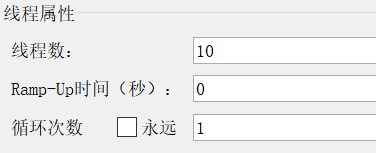
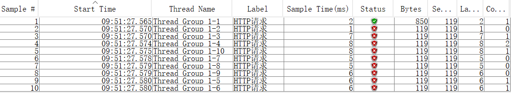
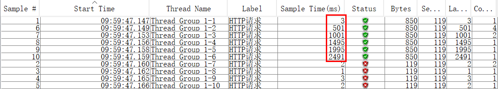
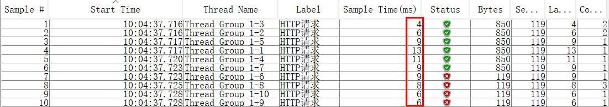

# Nginx限流

## limit_req_zone

作用：限制单位时间内的请求数，即速率限制,采用的漏桶算法 "leaky bucket"。

```bash
limit_req_zone $binary_remote_addr zone=limit:10m rate=2r/s;
server { 
    location / { 
        limit_req zone=limit burst=5 nodelay;
        limit_req_status 598;
    }
}
```

zone=one:10m，表示生成一个大小为 10M，名字为 one 的内存区域，用来存储访问的频次信息。

rate=2r/s，每秒允许通过同一 IP 下 2 个请求，由于 nginx 是按毫秒匀速计算的，所以是每 500ms 允许通过一个请求，如果 500ms 内有 2 个请求过来，只能通过一个。

burst=5，缓冲区大小为 5，意思就是当有大量的请求过来时，超过访问限制频次的请求会先放到缓冲区，可以放 5 个，多余的会拒绝掉。例如 500 ms 内发送 10 个请求，1 个立即处理，5 个进队列，4 个拒绝，每 500ms 处理 1 个，执行完需要 6*500ms=3s，平均速率仍然为 2r/s。

 nodelay，未添加这个参数时，缓冲区的请求会按照顺序排队处理，添加该参数后，缓冲区的请求可以立即处理。注意：允许立即处理可能会超出前面的速率限制，例如限制速率 2，缓冲区 5，在 500ms 内发送10个请求，会立即处理 1+5 个，4 个拒绝。500ms 内处理了 6 个请求，实际速率为 12r/s，已经突破了限制。

limit_req_status 598，自定义返回值，未添加该参数时默认返回 404。

利用 Apache Jmeter 测试，线程数设置 10，启动时间设置 0，循环次数设置 1，表示并发 10 个线程。



仅设置速率限制：



10 个请求仅 1 个被处理，9 个丢弃。

设置缓冲：



1 个立即被处理，4 个立即丢弃，5 个在缓冲区并按 2r/s 的速率依次处理。

设置 nodelay：



1 + 5 个立即被处理，4 个立即丢弃。

## limit_req_con

作用：限制同一时间连接数，即并发限制。并非所有的连接都被计数。只有在服务器处理了请求并且已经读取了整个请求头时，连接才被计数。

```bash
limit_conn_zone $binary_remote_addr zone=addr:10m;

server {
    location / {
        limit_conn addr 1;
    }
```

limit_conn addr 1，一次允许一个 IP 一个连接。

